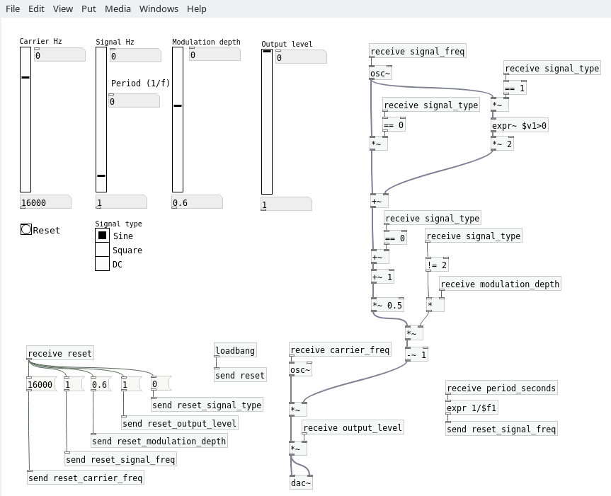
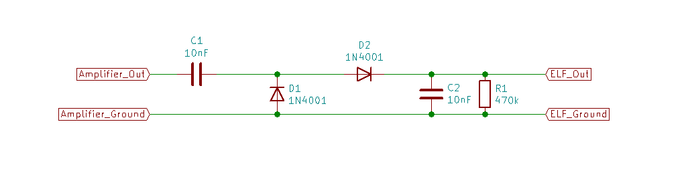

# Extreme Low Frequency Signal Generator
A Pure-Data patch and a little hardware to generate signals with extremely low frequencies.

Signal frequencies are normally measured in Hertz (cycles per second.)  The signals this program (and hardware) generate are so slow, that it's better to think of them in terms of the period.  

Need a sine wave with a period of 86400 seconds per cycle (1 cycle per day?)  This setup will do the job.  

Think in terms of millihertz, or microhertz.  You've never generated slow signals so easily.

Download [Purr Data](https://agraef.github.io/purr-data/) and the [AM_Signal_Generator.pd](https://github.com/JosephEoff/Extreme-Low-Frequency-Signal-Generator/blob/master/AM_Signal-Generator.pd) file.

Build the demodulator and attach it to an audio amplifier.  Generate extremely low frequency sine waves or square waves using your PC.

|Extreme low frequency signal generator GUI|
|------------------------------------------|
||

|Demodulator circuit|
|-------------------|
||

